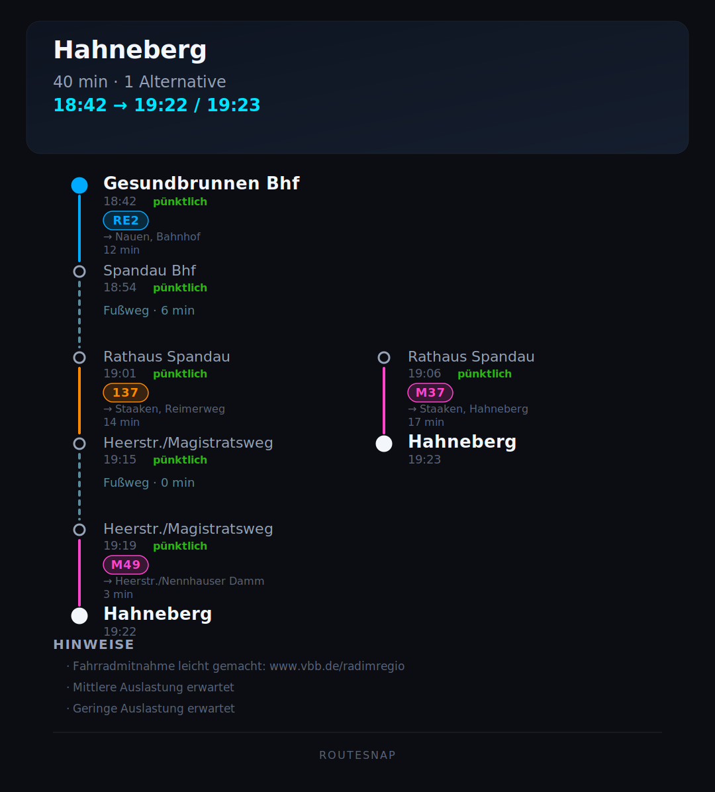

# RouteSnap

RouteSnap renders public-transport connections in dark-mode SVG image. It takes normalized journey JSON and produces a shareable graphic.



## What it does

- Reads journey data as JSON (from a file or stdin)
- Renders routes in a git-graph-style layout
- Shows duration, transfers, walking time, departure/arrival, delays, and remarks
- Outputs **SVG** with a mobile-friendly, neon-accented design


When two **different** routes exist, a shared trunk is drawn on the left and only the diverging section appears as a second branch on the right. Journeys that share the same stops and lines (e.g. later departures on the same connection) are treated as one route.

## Requirements

- Python 3.10+
- No third-party dependencies (stdlib only)

## Quick start

### Render from a JSON file

```bash
./routesnap render route.json --out route.svg
```

### Render from stdin

```bash
cat route.json | ./routesnap render --stdin --out route.svg
```

### Override the title

```bash
./routesnap render route.json --out route.svg --title "Nach Hause"
```

The title defaults to the shortened destination name when `--title` is omitted.

## Pipeline with `vbb.py`

This repo includes [`vbb.py`](vbb.py), a small VBB API client that fetches and normalizes journey data. 

```bash
# Fetch journeys and render in one step
python3 vbb.py journey --from "Berlin Hauptbahnhof" --to "Spandau" --json \
  | ./routesnap render --stdin --out route.svg

# Or save JSON first, then render
python3 vbb.py journey --from "Alexanderplatz" --to "Ostkreuz" --json > route.json
./routesnap render route.json --out route.svg
```

## JSON input format

RouteSnap expects the compact JSON produced by `vbb.py --json`:

```json
{
  "origin": { "id": "…", "name": "U Dahlem-Dorf (Berlin)" },
  "destination": { "id": "…", "name": "S+U Rathaus Spandau (Berlin)" },
  "journeys": [
    {
      "departure": "16:21",
      "arrival": "16:57",
      "duration_min": 36,
      "transfers": 1,
      "cancelled": false,
      "remarks": [],
      "legs": [
        {
          "type": "transit",
          "line": "U3",
          "direction": "Warschauer Straße",
          "origin": "U Dahlem-Dorf (Berlin)",
          "destination": "U Fehrbelliner Platz (Berlin)",
          "departure": "16:21",
          "arrival": "16:29",
          "duration_min": 8,
          "delay": "pünktlich",
          "cancelled": false,
          "remarks": []
        },
        {
          "type": "walk",
          "line": "walk",
          "origin": "U Fehrbelliner Platz (Berlin)",
          "destination": "U Fehrbelliner Platz (Berlin)",
          "departure": "16:29",
          "arrival": "16:29",
          "duration_min": 0,
          "delay": "pünktlich",
          "cancelled": false,
          "remarks": []
        }
      ]
    }
  ]
}
```

Each leg must include `type` (`"transit"` or `"walk"`) and `duration_min`.

## Route selection

When more than two journeys are provided, RouteSnap picks the best two **distinct paths**, ranked by:

1. Shortest duration
2. Fewest transfers
3. Shortest walking time
4. Earliest arrival

Identical paths at different times count as a single route.

## Tests

```bash
python3 -m pytest tests/ -q
```

## Project layout

| File | Purpose |
|---|---|
| `routesnap.py` | SVG renderer and CLI |
| `routesnap` | Shell wrapper around `routesnap.py` |
| `vbb.py` | VBB API client (optional data source) |
| `tests/test_routesnap.py` | Unit and integration tests |
| `MVP.md` | Full product and layout specification (German) |
